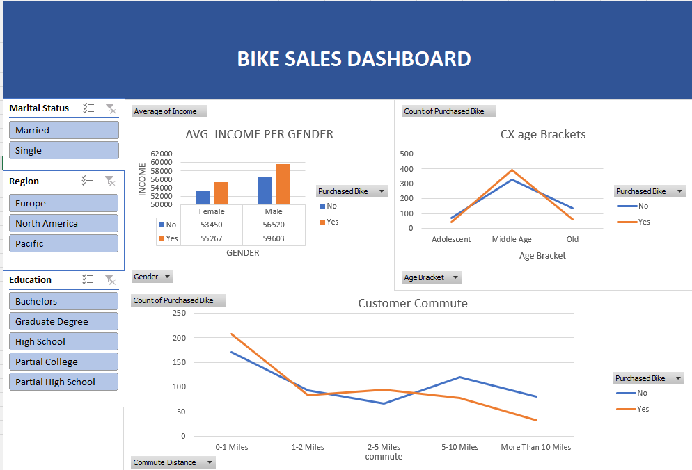
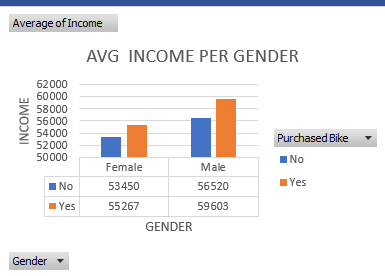
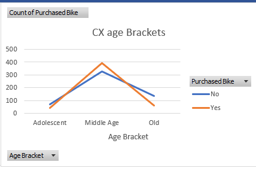
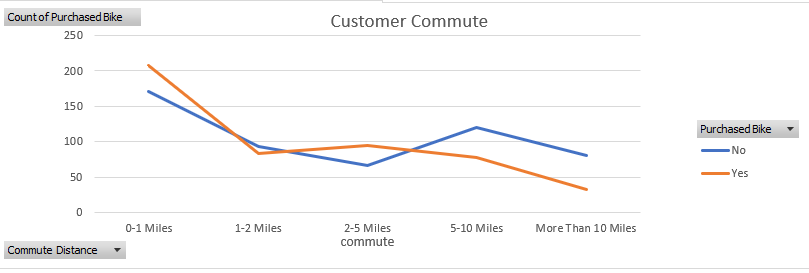
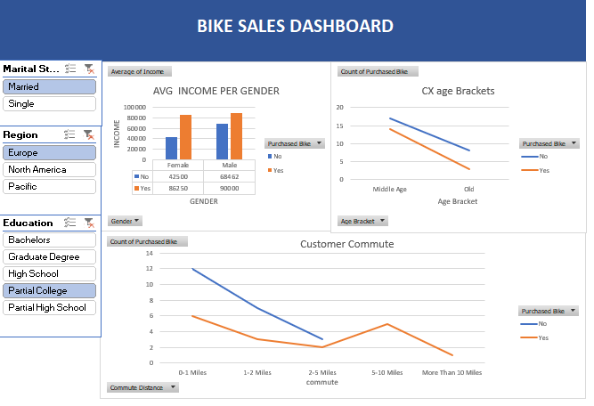

# bike-sales-insights-dashboard

📊 Customer Segmentation & Bike Sales Analysis

## 📌 Project Overview  
Developed an interactive Excel dashboard to analyze customer purchasing behavior and identify key demographic and lifestyle factors influencing bike sales.  

The analysis focuses on income distribution, age segmentation, regional patterns, and commute distance impact to support data-driven business decisions.

---

## 🛠 Tools & Techniques  
- Microsoft Excel  
- Pivot Tables  
- Slicers (Interactive Filters)  
- VLOOKUP & Data Cleaning  
- Conditional Formatting  
- KPI-Based Dashboard Design  

---

## 📂 Dataset  
- 1,000+ customer records  
- Demographic & behavioral variables including income, age, gender, region, education, commute distance, and purchase status  

---

## 📊 Dashboard Highlights  

### 🔹 Overall Performance View  

  

---

### 🔹 Income vs Purchase Behavior  

  

**Insight:**  
Higher income segments demonstrate stronger purchase probability, indicating price sensitivity differences across customer groups.

---

### 🔹 Age Segment Analysis  

  

**Insight:**  
Middle-aged customers represent the most responsive buyer segment, highlighting a key target demographic.

---

### 🔹 Commute Distance Impact  

  

**Insight:**  
Shorter commute distances correlate with increased purchase frequency, suggesting lifestyle-driven demand behavior.

---

### 🔹 Interactive Filtering Capabilities  

  

Dynamic slicers enable real-time segmentation by marital status, region, and education level for deeper demographic exploration.

---

## 💡 Key Business Insights  
- Income level is a primary driver of purchase likelihood.  
- The middle-aged demographic presents high revenue potential.  
- Regional and commute-based segmentation improves targeting strategy.  
- Interactive dashboards enhance decision-making efficiency.

---

## 🚀 Project Outcome  
Transformed raw customer sales data into actionable insights through structured pivot analysis and interactive dashboard design.  

This project demonstrates applied data analysis, business insight generation, and advanced Excel dashboard development.
